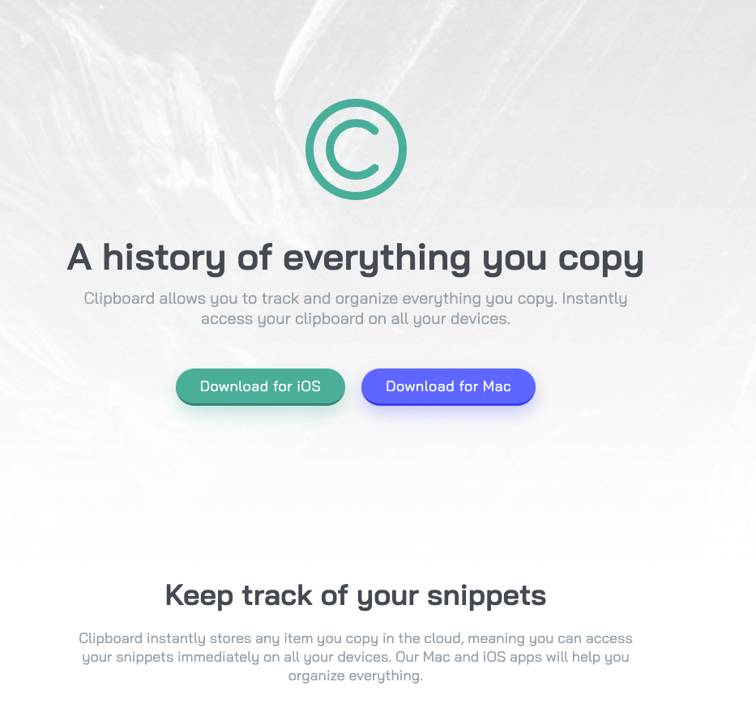

# Frontend Mentor - Clipboard landing page solution

This is a solution to the [Clipboard landing page challenge on Frontend Mentor](https://www.frontendmentor.io/challenges/clipboard-landing-page-5cc9bccd6c4c91111378ecb9). Frontend Mentor challenges help you improve your coding skills by building realistic projects. 

## Table of contents

- [Frontend Mentor - Clipboard landing page solution](#frontend-mentor---clipboard-landing-page-solution)
  - [Table of contents](#table-of-contents)
  - [Overview](#overview)
    - [The challenge](#the-challenge)
    - [Screenshot](#screenshot)
    - [Links](#links)
  - [My process](#my-process)
    - [Built with](#built-with)
    - [What I learned](#what-i-learned)
  - [Author](#author)

## Overview

### The challenge

Users should be able to:

- View the optimal layout for the site depending on their device's screen size
- See hover states for all interactive elements on the page

### Screenshot




### Links

- Solution URL: [GitHub](https://github.com/jakegodsall/clipboard-landing-page)
- Live Site URL: [Netlify](https://jakegodsall-clipboard-landing.netlify.app/)

## My process

### Built with

- Semantic HTML5 markup
- CSS custom properties
- Flexbox
- CSS Grid
- Sass
- 7-1 Sass Architecture

### What I learned

In this project I have used Sass mixins for the first time to horizontally centre components using flexbox layout.

```scss
  @mixin flexbox-center {
    display: flex;
    flex-direction: column;
    align-items: center;
  }
```

Also, I noticed after completing the project that although my layout looked fine at mobile resolutions on the browser dev tools, I wasn't getting the same results when loading the live site on a physical mobile device. 
The problem turned out to be that I was using `vh` units in order to vertically align elements. I was not taking into account the fact that the actual viewport of a browser on a mobile device is smaller than the screen resolution (address bar and menu).

## Author

-   Website - [Jake Godsall](https://jakegodsall.com)
-   Frontend Mentor - [@jakegodsall](https://www.frontendmentor.io/profile/jakegodsall)
-   LinkedIn - [@godsalljake](https://www.linkedin.com/in/godsalljake/)